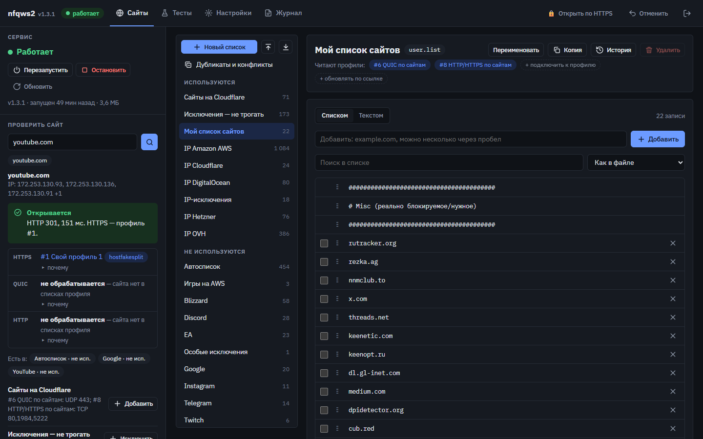
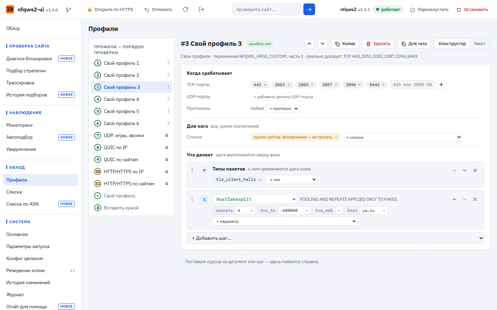
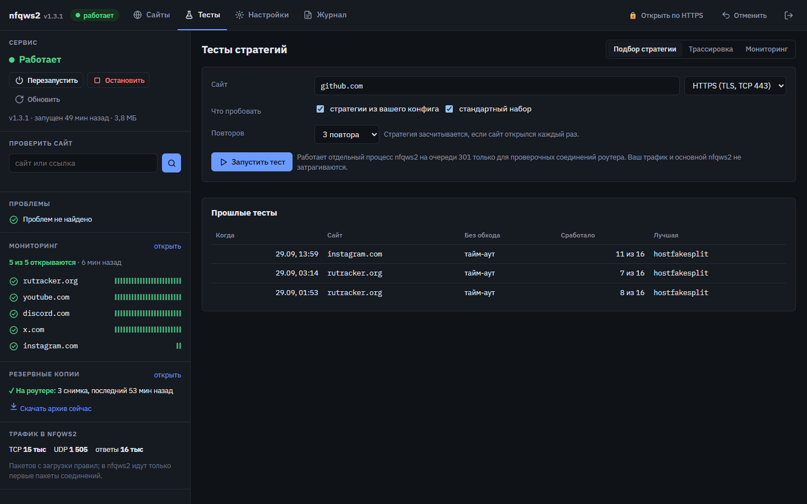
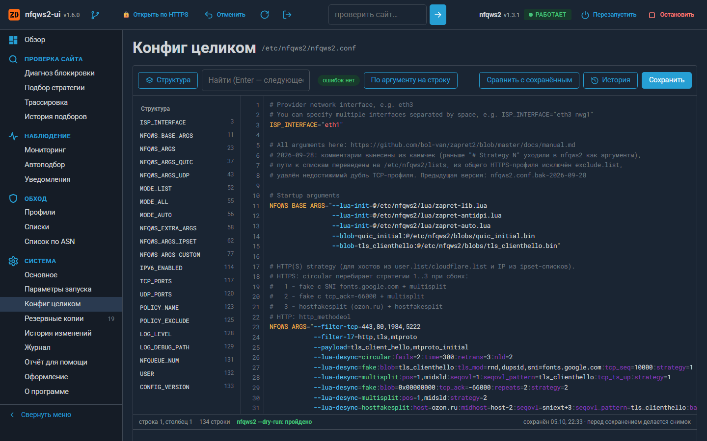
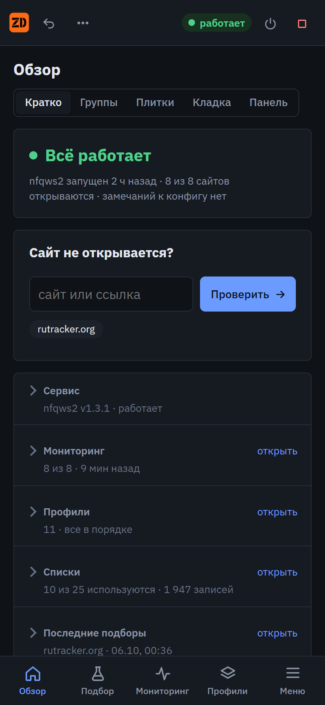

# nfqws2-ui

Веб-интерфейс для **nfqws2** (пакет [nfqws2-keenetic](https://github.com/nfqws/nfqws2-keenetic)) на роутерах с **OpenWrt**.

Интерфейс нужен, чтобы настраивать обход блокировок без SSH и без ручной правки конфига:
- видно, каким профилем пойдёт конкретный сайт и открывается ли он;
- ошибки в конфиге подсвечиваются ещё до сохранения;
- рабочую стратегию можно подобрать тестом;
- любое изменение можно откатить.

[](https://github.com/zemidala/nfqws2-ui/releases/latest)
[](LICENSE)



<p align="center">
  
  
</p>
<p align="center">
  
  
</p>

> ⚠️ **Прочитайте раздел [«Ограничения и предупреждения»](#ограничения-и-предупреждения) до установки.** Интерфейс работает с правами root и меняет правила iptables во время тестов.

## Что умеет

**Обзор** (на широком экране — колонка слева, видна на всех вкладках)
- Состояние nfqws2: перезапуск, остановка, версия, память, время работы.
- **Проверка сайта.** Показывает:
  - каким профилем пойдут HTTPS, QUIC и HTTP и почему именно им;
  - открывается ли сайт с роутера;
  - в каких списках он уже есть;
  - не уходит ли он в podkop.
- Проблемы в конфиге, мониторинг сайтов, резервные копии, счётчики трафика.

**Сайты** — менеджер списков (`/etc/nfqws2/lists`)
- Создание, импорт из файла, подписка по ссылке с ежедневным обновлением.
- Переименование: ссылки в конфиге обновляются сами.
- Копирование, удаление, перенос записей между списками, сортировка перетаскиванием.
- Проверка записей (`*.домен`, повторы, лишние поддомены) с кнопкой «Исправить».
- **Дубликаты и конфликты:** одинаковые записи в разных списках, сайт одновременно в обходе и в исключениях.

**Настройки**
- **Профили в порядке проверки.** Для каждого профиля есть:
  - конструктор: «когда срабатывает», «для кого», «что делает»;
  - шаги стратегии с параметрами из документации lua-функций;
  - текстовый вид с подсветкой и подсказками.
- **Конфиг целиком:** большой редактор со структурой, поиском, проверкой на лету и сравнением с сохранённым.
- **Проверка синтаксиса.** Справочник строится из самого nfqws2: `--help` и документация в `lua/*.lua`. Ловятся:
  - неизвестные параметры, неверные порты, L7 и payload;
  - отсутствующие файлы и блобы, lua-функции без обязательных аргументов.

  В конце выполняется `nfqws2 --dry-run`: конфиг, который nfqws2 не примет, сохранить нельзя. У многих замечаний есть кнопка **«Исправить»**. Она меняет только нужный аргумент и не трогает остальное форматирование.
- **Конфиг с другой системы.** Если вставить в редактор конфиг с Keenetic, из zapret2 или от nfqws первой версии, интерфейс это распознает и предложит **«Исправить под OpenWrt»**:
  - пути `/opt/etc/nfqws2/…`, `/opt/zapret2/lua/…`, `/opt/zapret2/files/fake/…` переносятся в `/etc/nfqws2/…`. Пути zapret2 и nfqws первой версии переносятся, только если такой файл здесь есть;
  - интерфейс провайдера, которого нет на роутере (`eth3`, `ppp0`, `pppoe-wan`), заменяется интерфейсом маршрута по умолчанию;
  - недостающие переменные (`USER`, `NFQUEUE_NUM`, `MODE_*`, порты и др.) добавляются со стандартными значениями, а lua-файлы, без которых не работает `--lua-desync`, подключаются.

  Правки попадают в редактор, а не сразу в файл: их видно до сохранения. Стратегии nfqws первой версии (`--dpi-desync`) автоматически не переводятся — интерфейс только предупредит о них.
- **Резервные копии:**
  - снимки на роутере: перед изменениями и раз в сутки;
  - скачивание архива, восстановление из файла.
- **История изменений:** версии каждого файла, сравнение, откат. Видны и правки, сделанные мимо интерфейса (по SSH, обновлением пакета).
- Оформление: три варианта дизайна, светлая и тёмная тема.
- **Обновления.** Интерфейс сам проверяет новые версии на GitHub: при открытии, если последняя проверка была больше 12 часов назад, и раз в сутки по расписанию. Если вышла новая версия, сверху появится плашка с кнопками «Что нового» и «Обновить». Обновление идёт с живым журналом, после него страница перезагрузится сама. Версия, ссылки и ручная проверка — в «Настройки → О программе». Там же, без выхода в интернет, открываются эта справка и изменения по версиям.
- **Журнал** с подсветкой: время, уровень, процесс, пути и файлы, параметры, адреса. Строки с ошибками и предупреждениями выделены целиком.

**Откат, если что-то перестало работать**
- «Отменить» в шапке отменяет последнее действие целиком, даже если оно затронуло несколько файлов.
- **«Перезапустить с проверкой».** После перезапуска интерфейс проверяет сайты из мониторинга. Если за 3 минуты не нажать «Всё работает», файлы и nfqws2 возвращаются к прежнему состоянию. Это сработает, даже если сам интерфейс перестал открываться.
- «Вернуть рабочее состояние» — к моменту последнего успешного запуска.

**Тесты**
- **Подбор стратегии.** Стратегии из вашего конфига и стандартный набор проверяются на выбранном сайте. Для этого запускается отдельный nfqws2 на очереди 301, и в него попадают только проверочные соединения самого роутера. Ваш трафик и основной nfqws2 не затрагиваются. «Применить» объясняет, куда лучше добавить найденную стратегию.
- **Трассировка:** nfqws2 с копией вашего конфига и `--debug` показывает, какой профиль сработал и что сделала стратегия.
- **Мониторинг:** сайты проверяются раз в N минут, при смене состояния приходят уведомления в Telegram (по желанию).

## Требования

| | |
|---|---|
| Система | **OpenWrt 24.10** (opkg). Проверено на 24.10.6, aarch64 (GL.iNet GL-MT6000) |
| nfqws2 | пакет **nfqws2-keenetic ≥ 1.3** уже установлен и работает (`/etc/nfqws2/nfqws2.conf`) |
| Зависимости | ставятся сами: `lighttpd` (+ `mod-cgi`, `mod-rewrite`, `mod-setenv`), `php8-cgi`, `php8-mod-session`, `php8-mod-curl`, `curl` |
| Место | ~0,3 МБ сам интерфейс; lighttpd + PHP ≈ 4–5 МБ, если их ещё нет |
| Память | php-cgi запускается на время запроса, постоянно висит только lighttpd (~1–2 МБ) |
| Браузер | любой современный; на телефоне тоже удобно |

## Установка

Одной командой на роутере (по SSH):

```sh
wget -qO- https://github.com/zemidala/nfqws2-ui/releases/latest/download/install.sh | sh
```

Конкретная версия:

```sh
wget -qO- https://github.com/zemidala/nfqws2-ui/releases/latest/download/install.sh | sh -s -- v1.0.0
```

Установщик выполняет шаги по порядку:
1. Проверяет, что это OpenWrt и nfqws2-keenetic на месте.
2. Скачивает пакет из релиза и сверяет контрольную сумму.
3. Ставит пакет через `opkg`, вместе с зависимостями.
4. Настраивает lighttpd.

В конце он печатает адрес. По умолчанию это **`http://192.168.1.1:8090`**; если порт занят, берётся следующий свободный.

Вход — логин **root** и его пароль. Если у root нет пароля, задайте его командой `passwd`: без пароля интерфейс не пускает.

### Вручную

1. Скачайте `nfqws2-ui_<версия>-1_all.ipk` со страницы [Releases](https://github.com/zemidala/nfqws2-ui/releases).
2. Скопируйте файл на роутер: `scp -O nfqws2-ui_*.ipk root@192.168.1.1:/tmp/`.
3. Установите: `opkg update && opkg install /tmp/nfqws2-ui_*.ipk`.

### Обновление

Кнопкой «Обновить» в интерфейсе или из консоли:

```sh
nfqws-ui update            # до последней версии
nfqws-ui update --check    # только проверить
nfqws-ui update v1.0.0 --force   # конкретная версия, например откат
```

Можно и той же командой установки. Настройки, история и снимки сохраняются. nfqws2, его конфиг и списки обновление не трогает.

### Удаление

```sh
opkg remove nfqws2-ui
```

Удаляются интерфейс, конфиг lighttpd и задания cron. **Остаются:**
- `/etc/nfqws-ui` — настройки интерфейса;
- `/etc/nfqws2/.snapshots` — снимки;
- `/etc/nfqws2/.history` — история.

Удалить и их: `rm -rf /etc/nfqws-ui /etc/nfqws2/.snapshots /etc/nfqws2/.history`.

lighttpd и PHP не удаляются: ими может пользоваться что-то ещё. Если они больше не нужны, удалите их вручную: `opkg remove lighttpd php8-cgi …`.

## Настройка: `nfqws-ui-setup`

`nfqws-ui` — короткое имя той же команды: `nfqws-ui status`, `nfqws-ui update`.

```text
nfqws-ui-setup status               адреса и текущие настройки
nfqws-ui-setup update               обновить до последней версии с GitHub
    [--check]                       только проверить, есть ли обновление
    [vX.Y.Z] [--force]              поставить конкретную версию / переустановить
nfqws-ui-setup version              установленная версия
nfqws-ui-setup port N               перенести интерфейс на порт N (по умолчанию 8090)
nfqws-ui-setup https on [N]         включить HTTPS на порту N (по умолчанию 8443)
    [--cert FILE --key FILE]        свой сертификат вместо самоподписанного
nfqws-ui-setup https off            выключить HTTPS
nfqws-ui-setup takeover on|off      занять порт 90 вместо nfqws-keenetic-web (старый — на 91)
nfqws-ui-setup auth on|off          вход по паролю root (выключать не рекомендуется)
nfqws-ui-setup cron on|off          фоновые задания: мониторинг, история, ежедневный снимок
nfqws-ui-setup apply                пересобрать конфиг lighttpd и cron из настроек
nfqws-ui-setup adopt                взять под управление написанный вручную конфиг lighttpd
nfqws-ui-setup remove               убрать конфиг lighttpd и задания cron (данные остаются)
```

Перед перезапуском lighttpd новый конфиг проверяется (`lighttpd -tt`). Если проверка не прошла, прежний файл возвращается.

**HTTPS.** Команда `nfqws-ui-setup https on` ставит `lighttpd-mod-mbedtls`, если его нет, и выпускает самоподписанный сертификат на 10 лет. Браузер один раз предупредит о нём: это ожидаемо. Если у вас есть свой домашний CA, передайте его сертификат через `--cert`/`--key`.

**Если стоит nfqws-keenetic-web**, оба интерфейса работают одновременно: старый на `:90`, новый на `:8090`. Команда `nfqws-ui-setup takeover on` отдаёт порт 90 новому интерфейсу, а старый переносит на `:91`.

## Ограничения и предупреждения

### Ограничения
- **Только nfqws2** и только формат конфига **nfqws2-keenetic** (`NFQWS_ARGS`, `NFQWS_ARGS_CUSTOM`, `NFQWS_ARGS_UDP` и т.д.). zapret с `config` от bol-van, nfqws первой версии и другие сборки не поддерживаются.
- **Keenetic / Entware не поддерживается и не проверялся.** Установщик на Keenetic откажется работать. Для Keenetic посмотрите [Keenetic-NFQWS-Web-Theme](https://github.com/Twinkle264/Keenetic-NFQWS-Web-Theme).
- **OpenWrt 25.x (apk) не проверялся.** Установщик ставит файлы без пакета, удаление — `nfqws-ui-setup uninstall`.
- Проверялось на iptables (nfqws2-keenetic использует iptables-legacy). С nftables-вариантами может не работать.
- **Тесты стратегий проверяют только TCP** (HTTPS и HTTP). QUIC/UDP не тестируется: это видно только в браузере.
- Тест показывает, открывается ли сайт **с роутера**. На устройствах результат может отличаться: DNS, IPv6, QUIC в браузере.
- Интерфейс только на русском.
- Шрифты загружаются с Google Fonts. Без доступа к ним используются системные шрифты, всё работает.

### Предупреждения
- **Интерфейс работает с правами root.** Он редактирует файлы в `/etc`, перезапускает nfqws2 и на время тестов добавляет правила iptables. lighttpd для этого запускается от root, как и у nfqws-keenetic-web.
- **Не открывайте интерфейс в интернет.** Не пробрасывайте порт с WAN. Для доступа извне используйте VPN (WireGuard/AmneziaWG) до домашней сети. Стандартный firewall OpenWrt входящие с WAN не пускает, не меняйте это ради интерфейса.
- **По HTTP пароль root идёт открытым текстом** по локальной сети. В сети с чужими устройствами включите HTTPS: `nfqws-ui-setup https on`.
- Защита от перебора пароля: не больше 5 неудачных попыток за 10 минут с одного адреса.
- **Резервные копии и скачиваемые архивы содержат `/etc/nfqws-ui/settings.json`**, а в нём токен Telegram-бота, если вы включили уведомления. Храните архивы соответственно.
- **Тесты временно добавляют цепочки iptables** `nfqws_test_post`/`nfqws_test_pre` для исходящих портов 40000–40999 самого роутера и запускают второй nfqws2 на очереди 301. После теста всё снимается. Если тест прервался (например, перезагрузка), цепочки пропадут при перезапуске firewall или nfqws2.
- Автоисправления и «Применить» меняют ваш конфиг. Перед каждым изменением делается снимок, откат — в один клик. Но проверяйте, что применяете.
- Обход блокировок регулируется законами вашей страны. Вы используете nfqws2 и этот интерфейс под свою ответственность.
- ПО распространяется **«как есть», без каких-либо гарантий** (см. [LICENSE](LICENSE)).
- Проект **не связан** с авторами zapret/nfqws2 (bol-van), nfqws2-keenetic и nfqws-keenetic-web.

## Где что лежит

| Что | Где |
|---|---|
| Интерфейс | `/www/nfqws-ui/` (index.html, app.js, app.css, api.php; docs/ — README и история версий для «Справки») |
| Утилита настройки | `/usr/sbin/nfqws-ui-setup` |
| Конфиг lighttpd | `/etc/lighttpd/conf.d/90-nfqws-ui.conf` (собирается `nfqws-ui-setup`) |
| Настройки веб-сервера | `/etc/nfqws-ui/web.json` (порты, HTTPS, вход) |
| Настройки интерфейса | `/etc/nfqws-ui/settings.json` (снимки, мониторинг, подписки, токен Telegram) |
| Сертификат HTTPS | `/etc/nfqws-ui/https.crt`, `https.key` |
| Мониторинг, прошлые тесты | `/etc/nfqws-ui/monitor.json`, `tests.json` |
| Снимки | `/etc/nfqws2/.snapshots/` |
| История изменений | `/etc/nfqws2/.history/` |
| Временное | `/tmp/nfqws-ui-*` |

Задания cron (`/etc/crontabs/root`):
- каждые 10 минут — поиск правок вне интерфейса и мониторинг;
- в 04:05 — ежедневный снимок и обновление подписок.

## Как это устроено

- Фронтенд — один `app.js` на чистом JavaScript, без сборки и зависимостей.
- Бэкенд — один `api.php`, работает под lighttpd через php-cgi.
- Профили берутся из командной строки запущенного nfqws2 и из конфига. Так видно и то, что работает сейчас, и то, что заработает после перезапуска.
- Проверка сайта повторяет логику выбора профиля в nfqws2: порты, L7, списки хостов и IP, исключения.
- podkop определяется по FakeIP (198.18.0.0/15) в ответе DNS 127.0.0.42.

## Вопросы

**Интерфейс не открывается.**
1. Выполните `nfqws-ui-setup status`: там адрес и состояние lighttpd.
2. Посмотрите журнал: `logread | grep lighttpd`.
3. Пересоберите конфиг: `nfqws-ui-setup apply`.

**«Неверный логин или пароль», хотя пароль верный.** Вход только под `root`. Проверьте, что у root задан пароль: `passwd`.

**Я вставил конфиг с Keenetic, а он не сохраняется.** Откройте «Настройки → Конфиг целиком». Над редактором появится плашка «Похоже, конфиг от Keenetic» со списком правок. Нажмите «Исправить под OpenWrt», проверьте и сохраните.

**Можно ли поставить рядом с nfqws-keenetic-web?** Да, они не мешают друг другу. См. `takeover` выше.

**Я правлю конфиг по SSH — интерфейс это увидит?** Да. Изменения попадут в историю не позже чем через 10 минут, и их можно откатить.

**Как вернуть всё как было после неудачного изменения?** Нажмите «Отменить» в шапке или «Вернуть рабочее состояние» в блоке «Сервис». Если не помогло: «Настройки → Резервные копии → Восстановить».

## Разработка

```sh
sh scripts/build.sh          # dist/: .ipk, .tar.gz, install.sh, sha256sums.txt
```

Релиз собирается GitHub Actions при пуше тега `v*`. Номер версии — в файле `VERSION`.

Быстро обновить файлы на роутере без пакета:

```sh
scp -O src/www/* root@192.168.1.1:/www/nfqws-ui/
```

## Благодарности

- [bol-van/zapret2](https://github.com/bol-van/zapret2) — nfqws2.
- [nfqws/nfqws2-keenetic](https://github.com/nfqws/nfqws2-keenetic) — пакет nfqws2 для OpenWrt и Keenetic.
- [nfqws/nfqws-keenetic-web](https://github.com/nfqws/nfqws-keenetic-web) — первый веб-интерфейс, с которого всё началось.
- [itdoginfo/allow-domains](https://github.com/itdoginfo/allow-domains) — готовые списки для подписок.

## Лицензия

[MIT](LICENSE) © 2026 zemidala
