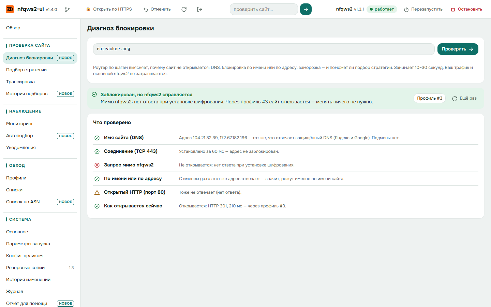
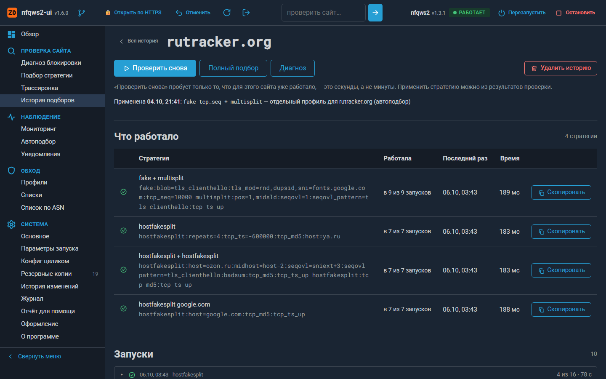

# nfqws2-ui

Веб-интерфейс для **nfqws2** (пакет [nfqws2-keenetic](https://github.com/nfqws/nfqws2-keenetic)) на роутерах с **OpenWrt** и, экспериментально, на **Keenetic** (Entware).

Интерфейс нужен, чтобы настраивать обход блокировок без SSH и без ручной правки конфига:
- видно, каким профилем пойдёт конкретный сайт и открывается ли он;
- ошибки в конфиге подсвечиваются ещё до сохранения;
- интерфейс по шагам выясняет, чем именно заблокирован сайт;
- рабочую стратегию можно подобрать тестом — а если сайт из мониторинга сломается, интерфейс подберёт её сам;
- любое изменение можно откатить.

[](https://github.com/zemidala/nfqws2-ui/releases/latest)
[](LICENSE)
[](https://t.me/nfqws2_ui)


<p align="center">
  
  
</p>
<p align="center">
  
  
</p>
<p align="center">
  
  
</p>

> ⚠️ **Прочитайте раздел [«Ограничения и предупреждения»](#ограничения-и-предупреждения) до установки.** Интерфейс работает с правами root и меняет правила iptables во время тестов.

## Что умеет

Кому полный вид кажется перегруженным, может включить «Упрощённый вид» в «Система → Оформление»: в меню шесть разделов (Обзор, Проверка сайта, Наблюдение, Профили, Списки, Система), страницы раздела — вкладками над страницей, «Обзор» — «Кратко», редкое из верхней панели (обновить данные, HTTPS, GitHub, выход) — под кнопкой «⋯».

**Обзор**
- Состояние nfqws2: перезапуск, остановка, версия, память, время работы. Если сервис не работает — **причина** (nfqws2 не принимает конфиг, выключен автозапуск, остановлен вручную) и последние строки журнала.
- **Проверка сайта.** Показывает:
  - каким профилем пойдут HTTPS, QUIC и HTTP и почему именно им;
  - открывается ли сайт с роутера;
  - в каких списках он уже есть;
  - не уходит ли он в podkop.
- Проблемы в конфиге, мониторинг сайтов, резервные копии, счётчики трафика, последние подборы и изменения.
- Предупреждение, если одновременно работает **другой обходчик** (zapret, youtubeUnblock, b4, byedpi): они правят те же пакеты и мешают друг другу.
- Вид «Кратко» (по умолчанию в упрощённом виде): строка «всё ли работает», поле «Сайт не открывается?» и свёрнутые подробности с итогом в строке (что раскрыто, запоминается; при остановке и замечаниях нужное раскрыто само). Ещё четыре вида: группы (по умолчанию), плитки, кладка, панель.

**Проверка сайта**
- **Диагноз блокировки.** Роутер по шагам выясняет, почему сайт не открывается, и называет причину простыми словами:
  - имя сайта: ответ DNS роутера сравнивается с защищённым DNS (Яндекс и Google) — видна подмена и заглушка провайдера;
  - соединение с адресом: блокировка по IP или по порту;
  - запрос мимо nfqws2 и с чужим именем: блокировка по имени сайта (SNI) или по адресу;
  - заморозка на объёме (ограничение «16–20 КБ»);
  - как сайт открывается сейчас и через какой профиль.

  В конце — вывод: поможет ли подбор стратегии, или нужен туннель.
- **Обрыв на 16 КБ.** Проба по крупным зарубежным сетям (Hetzner, OVH, Linode, Vultr и др.) и вашим сайтам: где провайдер замораживает соединение после 16–20 КБ, подбирается имя для фейка, которое это снимает, — сразу для всей сети. «Применить для сети» ставит профиль на список адресов сети по ASN.
- **Подбор стратегии.** Стратегии из вашего конфига, стандартный набор и то, что работало раньше, проверяются на выбранном сайте. Для этого запускается отдельный nfqws2 на очереди 301, и в него попадают только проверочные соединения самого роутера. Ваш трафик и основной nfqws2 не затрагиваются. «Применить» объясняет, куда лучше добавить найденную стратегию.
- **Каталог zapret2.** К подбору можно добавить расширенный (~275) или полный (~3100) набор стратегий по правилам blockcheck2. Большой набор проверяется параллельно, по 15 стратегий сразу; находки перепроверяются по одной, и рабочими считаются только подтверждённые. Находки пробы «Обрыв на 16 КБ» подбор пробует первыми.
- **Уточнение.** Если ни одна стратегия не открыла сайт каждый раз, подбор берёт ту, что продвинулась дальше всех, и перебирает у её фейка три вещи по очереди: чем портить, сколько слать (до 20) и какое имя подставлять. На это отведено до 5 минут. Галочка «искать вариант полегче» запускает уточнение и для рабочей стратегии.
- **Куда применить найденное.** Отдельный профиль только для этого сайта или замена стратегии существующего профиля. Если сработала стратегия, которая уже стоит в одном из профилей, а сайта просто нет в его списке, подбор предложит добавить сайт в этот список — без нового профиля и без перезапуска.
- **История подборов:** что и когда работало для каждого сайта. «Проверить снова» пробует только уже работавшее — это секунды, а не минуты.
- **Стратегии сообщества.** Общая база рабочих стратегий, разложенная по провайдерам (номер AS): [zemidala/nfqws2-strategies](https://github.com/zemidala/nfqws2-strategies). Подбор (и автоподбор) пробует до восьми стратегий, которые сработали у абонентов вашего провайдера, — сначала открывавшие тот же сайт или сайты в той же сети. Применяется только то, что открыло сайт на вашем роутере. Поделиться своей находкой — кнопка «Поделиться» у стратегии, открывшей сайт каждый раз (в результатах подбора и в истории подборов): откроется заполненная форма issue на GitHub, отправляете вы сами. У стратегии из базы, которая сработала и у вас, — «Подтвердить», которая не сработала, — «Не сработала». Стратегии, давно не подтверждавшиеся (больше 60 дней), пробуются после свежих, а ту, что не сработала у большинства, подбор не пробует вовсе. Страница «Стратегии сообщества» показывает всё, что есть для вашего провайдера, и проверяет на выбранном сайте; там же ссылка на всю базу по провайдерам на GitHub.
- **Трассировка:** nfqws2 с копией вашего конфига и `--debug` показывает, какой профиль сработал и что сделала стратегия.

**Наблюдение**
- **Мониторинг:** сайты проверяются раз в N минут.
- **Автоподбор.** Когда сайт из мониторинга перестаёт открываться (2–4 проверки подряд), роутер сам запускает подбор. Найденное либо предлагается кнопкой «Применить», либо — если включить — применяется само, с проверкой и откатом: записью в список профиля, если подошла стратегия, которая в нём уже стоит, иначе отдельным профилем только для этого сайта. По умолчанию автоподбор выключен.
- **Уведомления** в Telegram: сайт перестал или снова начал открываться, автоподбор что-то нашёл, применил или откатил. Если Telegram у провайдера закрыт, сообщения можно отправлять через туннель (выбирается интерфейс) или через SOCKS5/HTTP-прокси. ID чата узнавать на стороне не нужно: напишите боту и нажмите «Найти». На странице показано, какой бот подключён и в какой чат он пишет.

**Списки** — менеджер списков (`/etc/nfqws2/lists`)
- Два раздела — «Списки сайтов» и «IP-списки». Вид списка определяется по тому, как его подключает профиль (`--hostlist` или `--ipset`), у неподключённого — по содержимому. В строке списка видно, какие профили его читают и обход это или исключение; неподключённые списки свёрнуты.
- Создание, импорт из файла, подписка по ссылке с ежедневным обновлением.
- Переименование: ссылки в конфиге обновляются сами.
- Копирование, удаление, перенос записей между списками, сортировка перетаскиванием.
- Проверка записей (`*.домен`, повторы, лишние поддомены) с кнопкой «Исправить».
- **Дубликаты и конфликты:** одинаковые записи в разных списках, сайт одновременно в обходе и в исключениях.
- **Список по ASN:** адреса целой сети (хостинга, облака) по номеру её автономной системы или по имени сайта. Данные — RIPEstat, обновление раз в сутки.

**Профили**
- **Профили в порядке проверки.** Для каждого профиля есть:
  - конструктор: «когда срабатывает», «для кого», «что делает»;
  - шаги стратегии с параметрами из документации lua-функций;
  - текстовый вид с подсветкой и подсказками.
- **Поделиться профилем.** «Для чата» — параметры одной строкой с подписью (версия nfqws2, провайдер, система). «Вставить чужой» — текст из чата разбирается, лишнее отбрасывается, пути к спискам переделываются под роутер; стратегию можно испытать на сайте до добавления.

**Система**
- **Основное:** интерфейс провайдера определяется автоматически по маршруту по умолчанию или выбирается из интерфейсов роутера, режим работы, порты, IPv6.
- **Параметры запуска:** lua-скрипты, блобы и общие параметры nfqws2 добавляются из списков того, что есть на роутере.
- **Конфиг целиком:** большой редактор со структурой, поиском, проверкой на лету и сравнением с сохранённым.
- **Проверка синтаксиса.** Справочник строится из самого nfqws2: `--help` и документация в `lua/*.lua`. Ловятся:
  - неизвестные параметры, неверные порты, L7 и payload;
  - отсутствующие файлы и блобы, lua-функции без обязательных аргументов.

  В конце выполняется `nfqws2 --dry-run`: конфиг, который nfqws2 не примет, сохранить нельзя. У многих замечаний есть кнопка **«Исправить»**. Она меняет только нужный аргумент и не трогает остальное форматирование.
- **Конфиг с другой системы.** Если вставить в редактор конфиг с Keenetic, из zapret2 или от nfqws первой версии, интерфейс это распознает и предложит **«Исправить под OpenWrt»**:
  - пути `/opt/etc/nfqws2/…`, `/opt/zapret2/lua/…`, `/opt/zapret2/files/fake/…` переносятся в `/etc/nfqws2/…`. Пути zapret2 и nfqws первой версии переносятся, только если такой файл здесь есть;
  - интерфейс провайдера, которого нет на роутере (`eth3`, `ppp0`, `pppoe-wan`), заменяется интерфейсом маршрута по умолчанию;
  - недостающие переменные (`USER`, `NFQUEUE_NUM`, `MODE_*`, порты и др.) добавляются со стандартными значениями, а lua-файлы, без которых не работает `--lua-desync`, подключаются.

  Правки попадают в редактор, а не сразу в файл: их видно до сохранения. Стратегии nfqws первой версии (`--dpi-desync`) автоматически не переводятся — интерфейс только предупредит о них.
- **Резервные копии:**
  - снимки на роутере: перед изменениями и раз в сутки;
  - скачивание архива, восстановление из файла;
  - копии на NAS (или любом устройстве с ssh): роутер сам отправляет каждый новый снимок, там хранятся все, на роутере — несколько последних. Ключ роутера на NAS ограничен одной папкой: им можно положить новый снимок и прочитать старые, но нельзя удалить, перезаписать или войти в систему. Команду для NAS интерфейс покажет сам.
- **История изменений:** версии каждого файла, сравнение, откат. Видны и правки, сделанные мимо интерфейса (по SSH, обновлением пакета).
- **Отчёт для помощи:** текст для вопроса в чате или issue — версии, состояние, профили, названия списков, мониторинг, подборы. Без паролей, токена Telegram, внешнего адреса и содержимого списков; имена сайтов можно скрыть.
- **Оформление:** три компоновки (боковое меню, вкладки, вокруг сайта), четыре стиля («как в Keenetic» — по умолчанию, консоль, карточки, схема), светлая и тёмная тема; галочка «Упрощённый вид».
- **Обновления.** Интерфейс сам проверяет новые версии на GitHub: при открытии, если последняя проверка была больше 12 часов назад, и раз в сутки по расписанию. Если вышла новая версия, сверху появится плашка с кнопками «Что нового» и «Обновить». Обновление идёт с живым журналом, после него страница перезагрузится сама. Версия, ссылки и ручная проверка — в «Система → О программе». Там же, без выхода в интернет, открываются эта справка и изменения по версиям.
- **Журнал** с подсветкой: время, уровень, процесс, пути и файлы, параметры, адреса. Строки с ошибками и предупреждениями выделены целиком. У файлов журнала nfqws2 видно, сколько они занимают памяти, и есть «Очистить»; журнал больше 50 МБ программа сама подрезает до последнего 1 МБ (на OpenWrt `/var/log` — в оперативной памяти).

**Откат, если что-то перестало работать**
- «Отменить» в шапке отменяет последнее действие целиком, даже если оно затронуло несколько файлов.
- **«Перезапустить с проверкой».** После перезапуска интерфейс проверяет сайты из мониторинга. Если за 3 минуты не нажать «Всё работает», файлы и nfqws2 возвращаются к прежнему состоянию. Это сработает, даже если сам интерфейс перестал открываться.
- «Вернуть рабочее состояние» — к моменту последнего успешного запуска.

## Требования

| | |
|---|---|
| Система | **OpenWrt 24.10** (opkg). Проверено на 24.10.6, aarch64 (GL.iNet GL-MT6000).<br>**Keenetic с Entware** — экспериментально, см. [Keenetic](#keenetic-entware) |
| nfqws2 | пакет **nfqws2-keenetic ≥ 1.3** уже установлен и работает (`/etc/nfqws2/nfqws2.conf`, на Keenetic — `/opt/etc/nfqws2/nfqws2.conf`) |
| Зависимости | ставятся сами: `lighttpd` (+ `mod-cgi`, `mod-rewrite`, `mod-setenv`), `php8-cgi`, `php8-mod-session`, `php8-mod-curl`, `curl`; на Keenetic ещё `cron` |
| Место | ~0,3 МБ сам интерфейс; lighttpd + PHP ≈ 4–5 МБ, если их ещё нет |
| Память | php-cgi запускается на время запроса, постоянно висит только lighttpd (~1–2 МБ) |
| Браузер | любой современный; на телефоне тоже удобно |

## Установка

Одной командой на роутере (по SSH):

```sh
wget -qO- https://github.com/zemidala/nfqws2-ui/releases/latest/download/install.sh | sh
```

Конкретная версия:

```sh
wget -qO- https://github.com/zemidala/nfqws2-ui/releases/latest/download/install.sh | sh -s -- v1.0.0
```

Установщик выполняет шаги по порядку:
1. Проверяет, что это OpenWrt или Keenetic с Entware и что nfqws2-keenetic на месте.
2. Скачивает пакет из релиза и сверяет контрольную сумму.
3. Ставит пакет через `opkg`, вместе с зависимостями.
4. Настраивает lighttpd.

В конце он печатает адрес. По умолчанию это **`http://192.168.1.1:8090`**; если порт занят, берётся следующий свободный.

Вход — логин **root** и его пароль. Если у root нет пароля, задайте его командой `passwd`: без пароля интерфейс не пускает.

### Вручную

1. Скачайте `nfqws2-ui_<версия>-1_all.ipk` со страницы [Releases](https://github.com/zemidala/nfqws2-ui/releases). Для Keenetic — `nfqws2-ui_<версия>-1_all_entware.ipk`.
2. Скопируйте файл на роутер: `scp -O nfqws2-ui_*.ipk root@192.168.1.1:/tmp/`.
3. Установите: `opkg update && opkg install /tmp/nfqws2-ui_*.ipk`.

### Обновление

Кнопкой «Обновить» в интерфейсе или из консоли:

```sh
nfqws-ui update            # до последней версии
nfqws-ui update --check    # только проверить
nfqws-ui update v1.0.0 --force   # конкретная версия, например откат
```

Можно и той же командой установки. Настройки, история и снимки сохраняются. nfqws2, его конфиг и списки обновление не трогает.

### Удаление

```sh
opkg remove nfqws2-ui
```

Удаляются интерфейс, конфиг lighttpd и задания cron. **Остаются:**
- `/etc/nfqws-ui` — настройки интерфейса;
- `/etc/nfqws2/.snapshots` — снимки;
- `/etc/nfqws2/.history` — история.

Удалить и их: `rm -rf /etc/nfqws-ui /etc/nfqws2/.snapshots /etc/nfqws2/.history`.

lighttpd и PHP не удаляются: ими может пользоваться что-то ещё. Если они больше не нужны, удалите их вручную: `opkg remove lighttpd php8-cgi …`.

### Keenetic (Entware)

> Поддержка Keenetic **экспериментальная**. Установка, вход, обновление, HTTPS, редактор, списки, снимки и безопасный перезапуск проверены на стенде с Entware, но не на настоящем роутере. Перехват трафика и тесты стратегий на прошивке Keenetic не проверялись. Если вы поставили интерфейс на Keenetic, напишите, что получилось, в [Обсуждениях](https://github.com/zemidala/nfqws2-ui/discussions).

Нужны Entware и уже работающий nfqws2-keenetic. Команда установки та же, выполняется в консоли Entware (SSH, обычно порт 222).

Чем Keenetic отличается от OpenWrt:

- **Всё лежит под `/opt`.** К каждому пути из этого README добавьте `/opt` в начале: `/opt/etc/nfqws-ui`, `/opt/etc/nfqws2/.snapshots`, `/opt/etc/lighttpd/conf.d/90-nfqws-ui.conf`. Исключения: интерфейс — в `/opt/share/www/nfqws-ui/`, утилита — `/opt/sbin/nfqws-ui-setup`.
- **Вход — под root из Entware**, с тем же паролем, что для SSH в Entware (по умолчанию `keenetic`; смените его командой `passwd`). Учётная запись администратора прошивки не подходит.
- **Адрес** — `http://<адрес роутера>:8090`, обычно `http://192.168.1.1:8090`.
- **Системный журнал** ведёт прошивка, в интерфейсе его нет: смотрите раздел «Диагностика» в веб-интерфейсе Keenetic. Файлы журналов nfqws2 интерфейс показывает.
- **Задания cron** лежат в `/opt/etc/cron.d/nfqws-ui`.
- **HTTPS**: `nfqws-ui-setup https on` ставит `lighttpd-mod-openssl` и `openssl-util`.
- **В выборе интерфейса провайдера** нет имён вида wan/lan: только имена интерфейсов (`eth3`, `ppp0`), адреса и маршрут по умолчанию.
- podkop на Keenetic нет, его блок в проверке сайта не показывается.

## Настройка: `nfqws-ui-setup`

`nfqws-ui` — короткое имя той же команды: `nfqws-ui status`, `nfqws-ui update`.

```text
nfqws-ui-setup status               адреса и текущие настройки
nfqws-ui-setup update               обновить до последней версии с GitHub
    [--check]                       только проверить, есть ли обновление
    [vX.Y.Z] [--force]              поставить конкретную версию / переустановить
nfqws-ui-setup version              установленная версия
nfqws-ui-setup port N               перенести интерфейс на порт N (по умолчанию 8090)
nfqws-ui-setup https on [N]         включить HTTPS на порту N (по умолчанию 8443)
    [--cert FILE --key FILE]        свой сертификат вместо самоподписанного
nfqws-ui-setup https off            выключить HTTPS
nfqws-ui-setup takeover on|off      занять порт 90 вместо nfqws-keenetic-web (старый — на 91)
nfqws-ui-setup auth on|off          вход по паролю root (выключать не рекомендуется)
nfqws-ui-setup cron on|off          фоновые задания: мониторинг, история, ежедневный снимок
nfqws-ui-setup apply                пересобрать конфиг lighttpd и cron из настроек
nfqws-ui-setup adopt                взять под управление написанный вручную конфиг lighttpd
nfqws-ui-setup remove               убрать конфиг lighttpd и задания cron (данные остаются)
```

Перед перезапуском lighttpd новый конфиг проверяется (`lighttpd -tt`). Если проверка не прошла, прежний файл возвращается.

**HTTPS.** Команда `nfqws-ui-setup https on` ставит `lighttpd-mod-mbedtls`, если его нет, и выпускает самоподписанный сертификат на 10 лет. Браузер один раз предупредит о нём: это ожидаемо. Если у вас есть свой домашний CA, передайте его сертификат через `--cert`/`--key`.

**Если стоит nfqws-keenetic-web**, оба интерфейса работают одновременно: старый на `:90`, новый на `:8090`. Команда `nfqws-ui-setup takeover on` отдаёт порт 90 новому интерфейсу, а старый переносит на `:91`.

## Ограничения и предупреждения

### Ограничения
- **Только nfqws2** и только формат конфига **nfqws2-keenetic** (`NFQWS_ARGS`, `NFQWS_ARGS_CUSTOM`, `NFQWS_ARGS_UDP` и т.д.). zapret с `config` от bol-van, nfqws первой версии и другие сборки не поддерживаются.
- **Keenetic (Entware) — экспериментально**: проверено на стенде с Entware, но не на настоящем роутере, см. [Keenetic](#keenetic-entware). Прошивка Keenetic время от времени пересобирает правила iptables и может стереть временные правила теста стратегий посреди прогона — тогда тест нужно повторить.
- **OpenWrt 25.x (apk) не проверялся.** Установщик ставит файлы без пакета, удаление — `nfqws-ui-setup uninstall`.
- Проверялось на iptables (nfqws2-keenetic использует iptables-legacy). С nftables-вариантами может не работать.
- **Тесты стратегий проверяют только TCP** (HTTPS и HTTP). QUIC/UDP не тестируется: это видно только в браузере.
- Тест показывает, открывается ли сайт **с роутера**. На устройствах результат может отличаться: DNS, IPv6, QUIC в браузере.
- Интерфейс только на русском.
- **Автоподбор и диагноз видят сайт с роутера**, как и тесты. Автоподбор следит только за сайтами из мониторинга.
- Шрифты загружаются с Google Fonts. Без доступа к ним используются системные шрифты, всё работает.

### Предупреждения
- **Интерфейс работает с правами root.** Он редактирует файлы в `/etc`, перезапускает nfqws2 и на время тестов добавляет правила iptables. lighttpd для этого запускается от root, как и у nfqws-keenetic-web.
- **Не открывайте интерфейс в интернет.** Не пробрасывайте порт с WAN. Для доступа извне используйте VPN (WireGuard/AmneziaWG) до домашней сети. Стандартный firewall OpenWrt входящие с WAN не пускает, не меняйте это ради интерфейса.
- **По HTTP пароль root идёт открытым текстом** по локальной сети. В сети с чужими устройствами включите HTTPS: `nfqws-ui-setup https on`.
- Защита от перебора пароля: не больше 5 неудачных попыток за 10 минут с одного адреса.
- **Резервные копии и скачиваемые архивы содержат `/etc/nfqws-ui/settings.json`**, а в нём токен Telegram-бота, если вы включили уведомления. Храните архивы соответственно.
- **Тесты временно добавляют цепочки iptables** `nfqws_test_post`/`nfqws_test_pre` для исходящих портов 40000–40999 самого роутера и запускают второй nfqws2 на очереди 301. После теста всё снимается. Если тест прервался (например, перезагрузка), цепочки пропадут при перезапуске firewall или nfqws2.
- **Автоподбор в режиме «применять самому» меняет конфиг и перезапускает nfqws2 без вашего участия.** Он создаёт только отдельный профиль для сломавшегося сайта и возвращает конфиг, если сайт не открылся или перестал открываться другой сайт мониторинга. Режим выключен, пока вы его не включите.
- **Запросы наружу.** Диагноз спрашивает имя сайта у защищённого DNS Яндекса и Google. «Список по ASN», «Определить провайдера» и стратегии сообщества обращаются к RIPEstat (stat.ripe.net): номер AS провайдера — по внешнему адресу, сеть сайта — по его адресу; сам внешний адрес нигде не сохраняется. Стратегии сообщества скачиваются с GitHub — только файл вашего провайдера, не чаще раза в сутки и только когда подбор или страница их используют. Больше интерфейс никуда данные не отправляет; отчёт для помощи и «Поделиться» сами ничего не отправляют — форму на GitHub отправляете вы.
- **Стратегии сообщества присылают незнакомые люди.** Поэтому из базы берутся только шаги `--lua-desync` без путей к файлам (это проверяет и приём в базе, и сам роутер при загрузке), и ни одна стратегия не применяется без проверки подбором на вашем роутере.
- Автоисправления и «Применить» меняют ваш конфиг. Перед каждым изменением делается снимок, откат — в один клик. Но проверяйте, что применяете.
- Обход блокировок регулируется законами вашей страны. Вы используете nfqws2 и этот интерфейс под свою ответственность.
- ПО распространяется **«как есть», без каких-либо гарантий** (см. [LICENSE](LICENSE)).
- Проект **не связан** с авторами zapret/nfqws2 (bol-van), nfqws2-keenetic и nfqws-keenetic-web.

## Где что лежит

| Что | Где |
|---|---|
| Интерфейс | `/www/nfqws-ui/` (index.html, app.js, app.css, api.php; docs/ — README и история версий для «Справки») |
| Утилита настройки | `/usr/sbin/nfqws-ui-setup` |
| Конфиг lighttpd | `/etc/lighttpd/conf.d/90-nfqws-ui.conf` (собирается `nfqws-ui-setup`) |
| Настройки веб-сервера | `/etc/nfqws-ui/web.json` (порты, HTTPS, вход) |
| Настройки интерфейса | `/etc/nfqws-ui/settings.json` (снимки, мониторинг, автоподбор, подписки, списки по ASN, токен Telegram) |
| Сертификат HTTPS | `/etc/nfqws-ui/https.crt`, `https.key` |
| Копии на NAS | `/etc/nfqws-ui/remote_key` (ключ роутера, в снимки не попадает), `remote.json` (последняя отправка); на NAS — `~/.nfqws-ui-store.sh` и строка в `~/.ssh/authorized_keys` |
| Мониторинг, история подборов, автоподбор | `/etc/nfqws-ui/monitor.json`, `picks.json`, `auto.json`, `notify.json` (очередь и журнал уведомлений) |
| Снимки | `/etc/nfqws2/.snapshots/` |
| История изменений | `/etc/nfqws2/.history/` |
| Временное | `/tmp/nfqws-ui-*` (в том числе `nfqws-ui-community.json` — скачанные стратегии сообщества для вашего провайдера) |

Задания cron (`/etc/crontabs/root`):
- каждые 10 минут — поиск правок вне интерфейса, мониторинг и автоподбор;
- в 04:05 — ежедневный снимок, обновление подписок и списков по ASN.

## Как это устроено

- Фронтенд — один `app.js` на чистом JavaScript, без сборки и зависимостей.
- Бэкенд — один `api.php`, работает под lighttpd через php-cgi.
- Профили берутся из командной строки запущенного nfqws2 и из конфига. Так видно и то, что работает сейчас, и то, что заработает после перезапуска.
- Проверка сайта повторяет логику выбора профиля в nfqws2: порты, L7, списки хостов и IP, исключения.
- podkop определяется по FakeIP (198.18.0.0/15) в ответе DNS 127.0.0.42.

## Помощь и обратная связь

- **Чат в Telegram** — [t.me/nfqws2_ui](https://t.me/nfqws2_ui): помощь с установкой и настройкой, идеи, ошибки и новости о выпусках — по темам.
- **Вопрос по настройке** («как сделать…», «почему не открывается сайт») — [Обсуждения → Q&A](https://github.com/zemidala/nfqws2-ui/discussions/categories/q-a).
- **Идея** — [Обсуждения → Ideas](https://github.com/zemidala/nfqws2-ui/discussions/categories/ideas), там за неё можно проголосовать.
- **Ошибка** — [новый issue](https://github.com/zemidala/nfqws2-ui/issues/new/choose): укажите версии nfqws2-ui и nfqws2-keenetic, роутер и шаги.
- **Уязвимость** — только [приватно](https://github.com/zemidala/nfqws2-ui/security/advisories/new), см. [SECURITY.md](SECURITY.md).
- Ошибки самого nfqws2 и стратегий обхода — в [zapret2](https://github.com/bol-van/zapret2), установки nfqws2 и init-скрипта — в [nfqws2-keenetic](https://github.com/nfqws/nfqws2-keenetic).

Не публикуйте в конфигах и журналах пароли, ключи Wi-Fi/VPN и токен Telegram.

## Вопросы

**Интерфейс не открывается.**
1. Выполните `nfqws-ui-setup status`: там адрес и состояние lighttpd.
2. Посмотрите журнал: `logread | grep lighttpd` (на Keenetic — `/opt/var/log/lighttpd/error.log`).
3. Пересоберите конфиг: `nfqws-ui-setup apply`.

**«Неверный логин или пароль», хотя пароль верный.** Вход только под `root`. Проверьте, что у root задан пароль: `passwd`.

**Я вставил конфиг с Keenetic, а он не сохраняется.** Откройте «Система → Конфиг целиком». Над редактором появится плашка «Похоже, конфиг от Keenetic» со списком правок. Нажмите «Исправить под OpenWrt», проверьте и сохраните.

**Проверка пишет «соединение зависает на объёме».** Это ограничение ТСПУ «16-20 КБ»: соединения с зарубежными хостингами (Hetzner, DigitalOcean, OVH, Contabo и др.) зависают после ~16–20 КБ данных. Маленькие страницы открываются, остальное нет. Стандартные стратегии её обычно не снимают, но иногда помогает тонкая настройка фейков — «уточнение», которое подбор запускает сам, если ни одна стратегия не открыла сайт. В нашей проверке для сайта на Hetzner не сработала ни одна из 12 стандартных стратегий, а уточнение нашло рабочую: `hostfakesplit` с 16 фейками и подставным именем `ya.ru`. С другим именем и другим числом фейков она не работала. Результат зависит от провайдера; если уточнение не нашло рабочей стратегии, нужен VPN или прокси. Проверить своего провайдера можно чекером [dpi-checkers/tcp-16-20](https://hyperion-cs.github.io/dpi-checkers/ru/tcp-16-20/) (с выключенным VPN).

**Можно ли поставить рядом с nfqws-keenetic-web?** Да, они не мешают друг другу: старый интерфейс остаётся на `:90`, новый открывается на `:8090` (или забирает `:90` командой `takeover`, см. выше). Что стоит знать:

- оба правят одни и те же файлы — `nfqws2.conf` и списки, поэтому правка в одном сразу видна в другом;
- правки из nfqws-keenetic-web попадают в «Историю изменений» nfqws2-ui с пометкой «вне интерфейса», их можно посмотреть и откатить;
- не открывайте один и тот же файл на правку в обоих сразу: сохранится то, что записано последним;
- перезапуск nfqws2 из любого интерфейса действует на оба;
- если удалить nfqws2-ui, nfqws-keenetic-web продолжит работать. Если был включён `takeover`, порт 90 вернётся к старому интерфейсу. Последнее проверено только по коду: на нашем роутере nfqws-keenetic-web не стоит.

**Я правлю конфиг по SSH — интерфейс это увидит?** Да. Изменения попадут в историю не позже чем через 10 минут, и их можно откатить.

**Как вернуть всё как было после неудачного изменения?** Нажмите «Отменить» в шапке или «Вернуть рабочее состояние» в блоке «Сервис». Если не помогло: «Система → Резервные копии → Восстановить».

## Разработка

```sh
sh scripts/build.sh          # dist/: .ipk для OpenWrt и для Entware, .tar.gz, install.sh, sha256sums.txt
```

Релиз собирается GitHub Actions при пуше тега `v*`. Номер версии — в файле `VERSION`.

Быстро обновить файлы на роутере без пакета:

```sh
scp -O src/www/* root@192.168.1.1:/www/nfqws-ui/
```

## Благодарности

- [bol-van/zapret2](https://github.com/bol-van/zapret2) — nfqws2.
- [nfqws/nfqws2-keenetic](https://github.com/nfqws/nfqws2-keenetic) — пакет nfqws2 для OpenWrt и Keenetic.
- [nfqws/nfqws-keenetic-web](https://github.com/nfqws/nfqws-keenetic-web) — первый веб-интерфейс, с которого всё началось.
- [itdoginfo/allow-domains](https://github.com/itdoginfo/allow-domains) — готовые списки для подписок.

## Лицензия

[MIT](LICENSE) © 2026 zemidala
